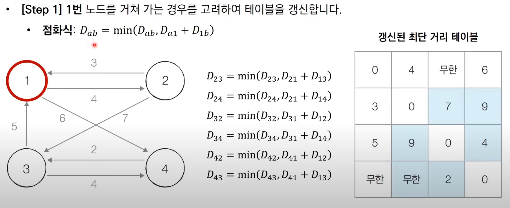

## 다익스트라
- **"한 지점에서 다른 특정 지점까지의 최단 경로를 구하는 경우"**
- 우선 순위 큐인 heapq를 사용하면 시간복잡도를 낮출 수 있음
- V : 노드의 개수, E: 간선의 개수
    - 기존 다익스트라 복잡도: O(V^2)
    - 개선한 다익스트라 : O(ElogV)
        - 이유 : 우선순위 큐를 사용하여 최소거리를 쉽게 가져오기에
- 간선의 개수, 노드의 개수가 많으면 다익스트라를 써야함
```Python
    graph = [[] for i in range(n + 1)]
    distance = [INF] * (n+1)
```


## 플로이드 워셜 
- **"모든 지점에서 다른 모든 지점까지의 최단 경로를 구하는 경우"**
- 다이나믹 프로그래밍이라고 볼 수 있음
- 점화식을 세워야 함
- 간선의 개수, 노드의 개수가 한정적이면 다익스트라보다 유리함(100개 이하)
- ex) ect_9-3.py
- 1번을 거쳐갈 때와 바로 가는 것과의 최솟값을 비교하고 갱신  
    
```Python
    graph = [[INF] * (n + 1) for _ in range(n+1)]
```